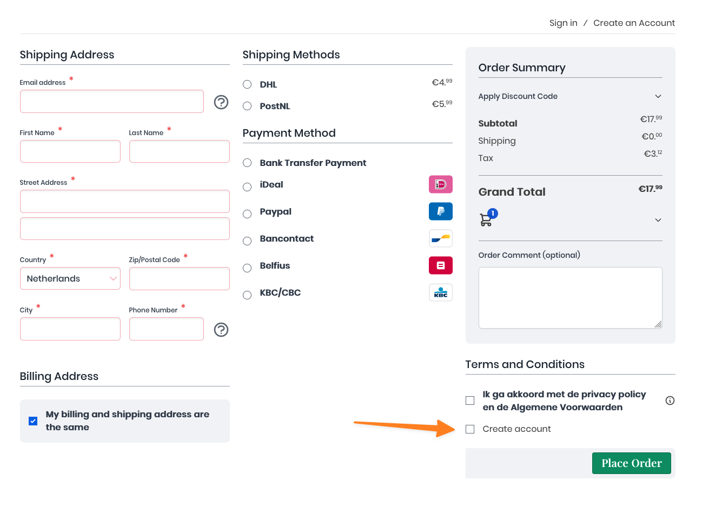

# Vendic_HyvaCheckoutCreateAccount
This module adds a "create account" checkbox to the [Hyva Checkout](https://www.hyva.io/hyva-checkout.html). 

When checked, it will automatically:
- Create an account for the customer
- Assign the current order to the customer
- Send a password reset email to the customer



## Installation
```bash
composer require vendic/hyva-checkout-create-account
```

## Configuration
None at this moment. Feel free to create a pull request if you need specific settings. Check the [issues](https://github.com/Vendic/hyva-checkout-create-account/issues) for tickets that need help.

## Compatibility
- [Hyvä Themes](https://www.hyva.io/hyva-themes-license.html) ^1.0
- [Hyva Checkout](https://www.hyva.io/hyva-checkout.html) ^1.1
- Magento 2 or [Mage-OS](https://mage-os.org/) ^2.4.4

## License
[MIT](./LICENSE.txt)
