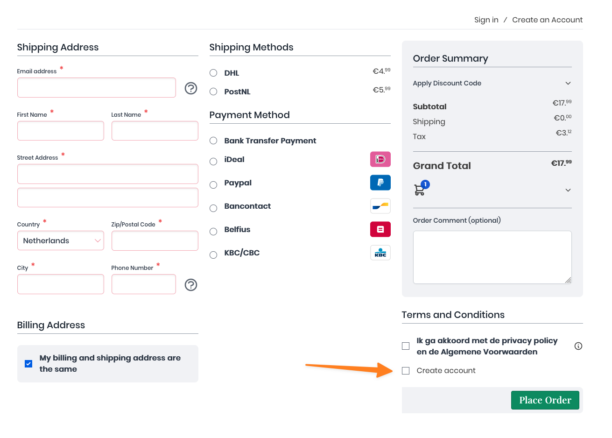

# Vendic_HyvaCheckoutCreateAccount [](https://github.com/Vendic/hyva-checkout-create-account/actions/workflows/coding-standard.yml)
This module adds a "create account" checkbox to the [Hyva Checkout](https://www.hyva.io/hyva-checkout.html). 

When checked, it will automatically:
- Create an account for the customer
- Assign the current order to the customer
- Send a password reset email to the customer



## Installation
```bash
composer require vendic/hyva-checkout-create-account
```

## Configuration
This module introduces a configuration section under **Stores > Configuration > Hyvä Themes > Checkout > New Customer** with the following options:

- **Enable New Customer**: Enables the "create account" checkbox on the checkout page.
- **Send Reset Password Mail**: If enabled, a reset password email will be sent after the customer account is created.
- **Create Password Template**: Allows you to select the email template used when sending the reset password mail.

Feel free to create a pull request if you need additional configuration options. Check the [issues](https://github.com/Vendic/hyva-checkout-create-account/issues) for tickets that need help.

## Compatibility
- [Hyvä Themes](https://www.hyva.io/hyva-themes-license.html) ^1.0
- [Hyva Checkout](https://www.hyva.io/hyva-checkout.html) ^1.1
- Magento 2 or [Mage-OS](https://mage-os.org/) ^2.4.4

## License
[MIT](./LICENSE.txt)
